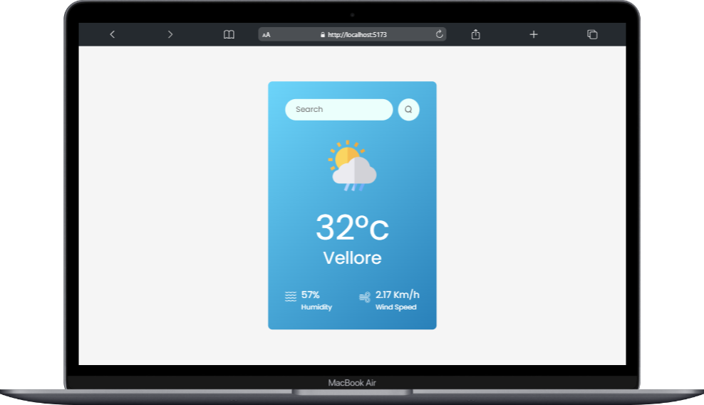

# 🌤️ Weather App

A simple and responsive weather application built with **React.js** and **OpenWeather API**.

---

## 🚀 Features
- Search weather by city name
- Displays temperature, humidity, wind speed
- Clean UI with modern design
- Responsive for mobile and desktop

---

## 🛠️ Tech Stack
- React.js
- CSS
- OpenWeatherMap API
- Vite

---

## 🖥️ Screenshots


---

## 💻 Setup & Installation

1. Clone the repository
```bash
git clone https://github.com/amalrajcs/weather-app.git 
